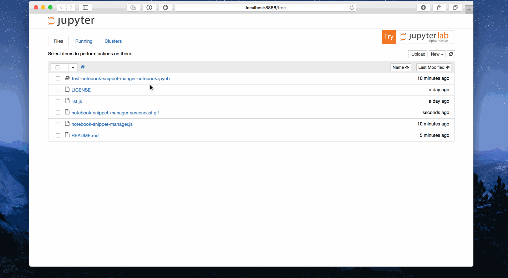

# notebook-snippet-manager
notebook-snippet-manager Jupyter Notebook extension for managing code snippets.
The extension uses the browser's WebStorage API so clearing browsing data will
wipe out all snippets and the amount of snippets that you can store is limited
by the space limitations of your browser's WebStorage implementation. Please note
that this extension is in beta, if you experience any difficulties, please submit
any issue and I will do my best to address them promptly. Don't forget to star this
repository so you can stay on top of the latest updates!

### To Dos
- [ ] Explore alternatives to WebStorage
- [ ] Add ability to search through snippets

### Installation Instructions
1. Run `jupyter --data-dir` to determine the location of your Jupyter Notebook configuration
2. Download `notebook-snippet-manager.js` and `list.js` and copy them to `$(jupyter --data-dir)/nbextensions`.
3. Run `jupyter nbextension enable notebook-snippet-manager`.

    cp list.js notebook-snippet-manager.js $(jupyter --data-dir)/nbextensions

### Usage Screencast

